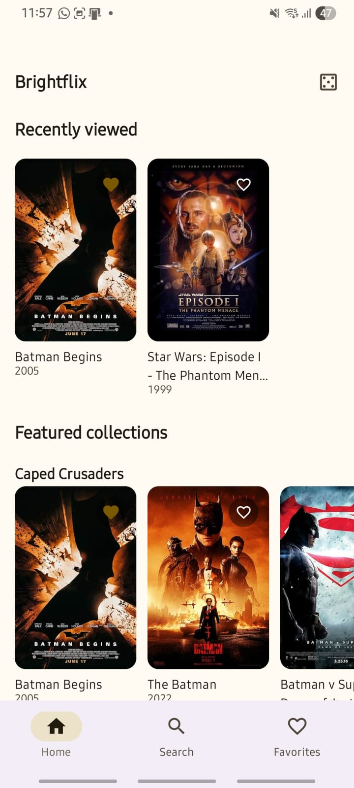
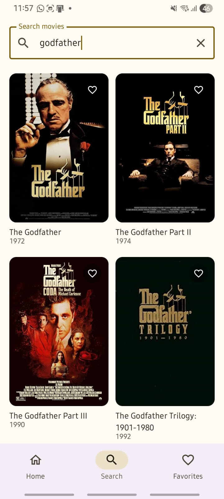
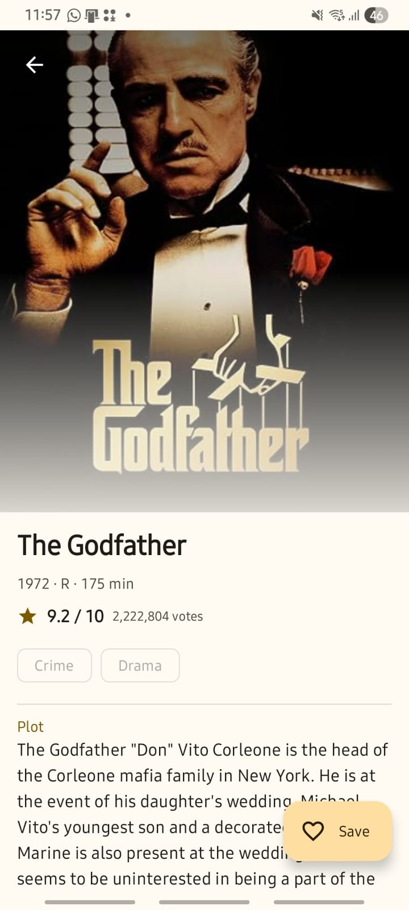
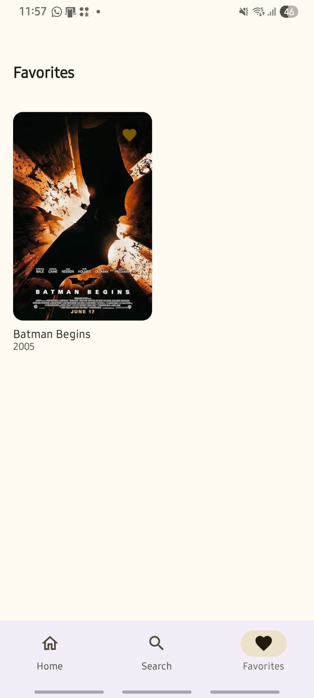
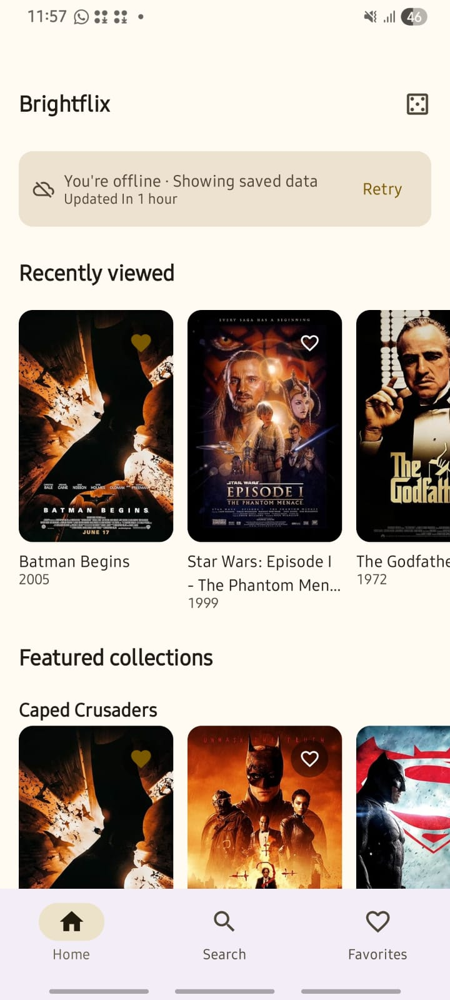

# Brightflix

**Discover. Save. Come back anytime.**

An Android movie discovery client for the [OMDb API](https://www.omdbapi.com/). Browse
curated collections, search the catalogue live as you type, read rich movie detail, and
save films to a favorites list that persists locally and works with no connection.

Built with Kotlin, Jetpack Compose and Material 3, in a single Gradle module with a
three-layer architecture (presentation → domain → data).

---

## Screenshots

> Capture these from a device or emulator running the debug build, and drop them in
> `docs/screenshots/`. The layouts below are the ones worth showing.

| Home | Search | Detail |
| :---: | :---: | :---: |
|  |  |  |
| Curated collections and Recently Viewed | Live search with pagination | Full detail with favorite action |

| Favorites | Offline |
| :---: | :---: |
|  |  |
| Saved movies, available offline | Cached content with a "showing saved data" banner |

**To capture the offline shot:** load the app once with a connection, then enable
aeroplane mode and relaunch. Home keeps rendering its cached collections with the staleness
banner, and Favorites and Recently Viewed continue to work normally.

---

## Features

### Required

| Feature | Notes |
| --- | --- |
| **Movie list** | Home renders three curated collections plus Recently Viewed, as horizontal poster carousels. |
| **Movie detail** | Full record — plot, cast, ratings, awards, box office. Only the IMDb ID crosses the navigation boundary. |
| **Live search** | Debounced Flow pipeline; typing a word issues **one** request, not one per keystroke. |
| **Favorites** | Persisted in Room, consistent across every screen, fully available offline. |

### Additional

| Feature | Notes |
| --- | --- |
| **Recently Viewed** | Opening a movie records it. Re-opening moves it to the top rather than duplicating it; history is capped at 20. |
| **Offline-first behaviour** | Detail and collections are cached with a TTL. A failed refresh keeps content on screen and explains itself instead of erasing the page. |
| **Paginated search** | Infinite scroll with correct termination, duplicate-request guards, and protection against stale pages. |
| **Pull-to-refresh** | Bypasses the cache TTL. Content stays visible throughout; a failure is recoverable and non-destructive. |
| **Surprise Me** | Opens a random movie drawn from already-cached data. Costs no API request and works offline. |
| **Request minimisation** | Debounce, a minimum query length, TTL-gated refresh, and an HTTP cache, because OMDb's free tier allows 1000 requests per day. |

---

## Tech Stack

| Concern | Choice |
| --- | --- |
| Language | Kotlin 2.4.20 |
| UI | Jetpack Compose, Material 3 |
| Architecture | MVVM + Clean-Architecture layering |
| Async | Coroutines, Flow / StateFlow |
| DI | Hilt 2.60.1 (KSP) |
| Networking | Retrofit 3.0.0, OkHttp 5.5.0, kotlinx.serialization |
| Persistence | Room 2.8.4 |
| Images | Coil 3.6.2 |
| Navigation | Navigation Compose 2.10.0, type-safe routes |
| Testing | JUnit4, Turbine, Robolectric, Compose UI Test |
| Build | AGP 9.4.0, Gradle 9.7.1, compileSdk 37, minSdk 25 |

---

## Architecture

```
┌─────────────────────────────────────────────┐
│ presentation   Compose UI + ViewModels      │
│                UI state, navigation         │
└───────────────────────┬─────────────────────┘
                        │ depends on
┌───────────────────────▼─────────────────────┐
│ domain         Models, repository contracts │
│                Use cases                    │
│                (pure Kotlin, no Android)    │
└───────────────────────▲─────────────────────┘
                        │ implements
┌───────────────────────┴─────────────────────┐
│ data           Retrofit + DTOs + mappers    │
│                Room + entities + DAOs       │
│                Repository implementations   │
└─────────────────────────────────────────────┘
```

Rules that hold throughout:

- **`domain` is pure Kotlin.** No Android, Retrofit, or Room imports.
- **ViewModels never see infrastructure.** No DAOs, no Retrofit services, no DTOs. They
  depend on use cases and on domain repository *interfaces*.
- **Repository interfaces live in `domain`; implementations live in `data`.** That
  inversion is what makes the domain layer testable without an Android environment.
- **DTOs never leave `data`.** Mapping to domain models happens at the data-source boundary.

### Why not multi-module?

Multi-module would demonstrate familiarity with scaling patterns, but for four screens it
buys Gradle complexity and configuration surface without buying isolation that package
boundaries do not already provide. Layer separation is enforced by dependency direction and
reviewed as such. At the scale where parallel team ownership or build time became a real
constraint, the existing layer boundaries are already the natural module seams. This is a
deliberate trade-off, not an omission.

---

## Project Structure

```
com.application.brightflix
├── core/
│   ├── di/              Qualifiers, dispatcher and core bindings
│   ├── network/         NetworkMonitor (connectivity as a Flow)
│   ├── result/          AppResult, AppError, Cached, RefreshState, Staleness
│   └── time/            TimeProvider — injectable clock, so TTL is testable
├── data/
│   ├── remote/          OmdbApi, DTOs, mappers, MovieRemoteDataSource, NetworkModule
│   ├── local/           Entities, DAOs, database, converters, DatabaseModule
│   └── repository/      Three repository implementations + bindings
├── domain/
│   ├── model/           Movie, MovieDetail, SearchPage, HomeFeed, CuratedCollections
│   ├── repository/      Three repository contracts
│   └── usecase/         Four use cases
├── presentation/
│   ├── navigation/      Type-safe routes, NavHost, bottom bar
│   ├── home/  search/  detail/  favorites/
└── ui/
    ├── theme/           Colour, type, spacing tokens
    └── components/      PosterImage, MoviePosterCard, EmptyState, ErrorState, …
```

There is no `util` package: helpers live beside the code that needs them.

---

## Data Flow

**Search** (network only, never cached):

```
SearchScreen → SearchViewModel → SearchMoviesUseCase → MovieRepository
            → MovieRemoteDataSource → OmdbApi → OMDb
```

**Movie detail** (cache-first, then a conditional refresh):

```
MovieDetailScreen → MovieDetailViewModel → ObserveMovieDetailUseCase
                 ├─ MovieRepository.observeMovieDetail()  → Room  (emits immediately)
                 └─ FavoritesRepository.observeFavoriteIds()      (joined in)

refreshMovieDetail(force = false)
   └─ cache fresh?  → return, no request issued
      cache stale?  → OMDb → write to Room → the Flow above re-emits
      request fails → cache untouched, RefreshState.Failed emitted alongside it
```

---

## Offline-First Strategy

Caching is **tiered by ownership** rather than applied uniformly:

| Data | Strategy | TTL | Why |
| --- | --- | --- | --- |
| Favorites | Room is the single source of truth. Never fetched. | — | User-authored data; the network is irrelevant to it. |
| Recently Viewed | Room is the single source of truth. | — | Same. |
| Movie detail | Cache-first, refresh only when stale or forced. | 7 days | Where offline hurts most: opening a saved movie with no connection. Detail is near-immutable, so a long TTL is both correct *and* the biggest saving against the API quota. |
| Home collections | Cache-first, same failure semantics. | 24 hours | Makes a cold offline launch useful instead of empty. |
| Search results | **Not cached** — deliberately. | — | See [Deliberate Non-Features](#deliberate-non-features). |

### Four states, not one boolean

Offline support here is not an `isOffline` flag. Cached reads emit a `Cached<T>` carrying
the data, when it was last updated, and the state of the refresh behind it — which lets the
UI distinguish:

| Condition | What the user sees |
| --- | --- |
| No data, refreshing | Skeleton placeholders that preserve layout |
| No data, refresh failed | Full-screen error **with** a retry |
| **Data present, refresh failed** | **Content stays.** A quiet banner: "Couldn't refresh · Showing saved data · Updated 12 minutes ago" |
| Data present, offline | Content stays. "You're offline · Showing saved data" |

**Content is never replaced by an error screen when usable data exists.** A `NetworkMonitor`
backed by `ConnectivityManager` (checking `NET_CAPABILITY_VALIDATED`, so a captive-portal
Wi-Fi does not read as "online") separates "offline" from "the server failed", because those
warrant different messages.

---

## Search Strategy

```kotlin
queryInput
    .debounce(400)                       // one request per settled query
    .map(String::trim)
    .distinctUntilChanged()              // re-typing the same query changes nothing
    .onEach { nextPageJob?.cancel() }    // guard 1
    .flatMapLatest(::firstPageFlow)      // cancels the superseded request
    .onEach(::applyFirstPage)
    .launchIn(viewModelScope)
```

Typing `b → ba → bat → batm → batma → batman` issues **one** request. Queries shorter than
two characters never reach the network at all, and that rule lives in the use case rather
than the UI, so it holds regardless of caller.

### The stale-append problem

The first page is driven by a Flow; pagination is imperative. `flatMapLatest` cancels a
superseded *first-page* request, but an in-flight *next-page* request is not part of that
chain — so page 3 of "batman" could append itself onto the results for "inception".

Two independent guards close this:

1. **Cancellation** — a new query cancels the retained pagination job.
2. **Query-token validation** — every page request carries the query it was issued for, and
   the append is dropped if that token no longer matches current state.

The second exists because cancellation can lose the race: a request that has already
returned and is resuming cannot be cancelled. Both are covered by regression tests, one of
which deliberately makes the request **uncancellable** so it exercises the token guard alone.

Pagination also guards against duplicate requests. That guard is claimed *synchronously*,
before the coroutine launches — setting it inside the coroutine is too late, because a lazy
list fires its "near the end" signal on consecutive frames and every call would slip
through. This was a real bug, caught by a test.

---

## Design Patterns

| Pattern | Where, and what it earns |
| --- | --- |
| **MVVM** | Compose observes immutable `StateFlow` state via `collectAsStateWithLifecycle()`. ViewModels hold no Android UI references. |
| **Repository** | The domain and presentation layers never learn whether a movie came from OMDb or Room. |
| **Dependency injection** | Hilt throughout. Every dependency is constructor-injected, which is what makes the test suite possible without mocking frameworks. |
| **Single source of truth** | One Room query, `observeFavoriteIds()`, drives favorite state on **every** screen. |
| **Reactive state** | Flow/StateFlow end to end; Room emits on write, so a favorite toggled anywhere updates everywhere. |
| **Use cases** | Four, each doing real composition or branching. Pass-throughs were deliberately *not* created — see below. |

### Favorite consistency

Every screen that renders a movie combines its own content with one shared stream:

```kotlin
combine(movies, favoriteIds) { list, ids ->
    list.map { MovieListItem(it, isFavorite = it.imdbId in ids) }
}
```

No screen owns favorite state, so no screen can drift. Favoriting on Detail updates Home,
Search and Favorites in the same frame — the desync failure mode is *structurally
impossible*, not merely avoided by discipline.

### Why only four use cases

`SearchMovies`, `ObserveMovieDetail`, `ObserveHomeFeed` and `ToggleFavorite` each perform
real work — query policy, multi-source composition, or read-then-branch logic. A
`GetSurpriseMovieUseCase` that only forwards to `repository.randomCachedMovie()` would add
a file and no behaviour. Since repository *interfaces* are themselves domain contracts, a
ViewModel depending on one is already depending on the domain layer. The rule applied is:
**use cases where there is logic, domain repository interfaces for plain observable reads.**

---

## Testing

**126 tests, all executing on the JVM via `./gradlew test`.** Room and Compose tests run
under Robolectric, so they genuinely execute rather than shipping as never-run code.

| Suite | Tests | Covers |
| --- | ---: | --- |
| `MovieMappersTest` | 21 | `"N/A"` → null across every field, runtime/vote parsing, list splitting, malformed input never throwing |
| `MovieRemoteDataSourceTest` | 12 | OMDb's HTTP-200 failures, transport-error classification, cancellation not being swallowed |
| `MovieRepositoryTest` | 17 | TTL gating, forced refresh, failure-with-warm-cache, collection replacement, search never touching the DB |
| `SearchViewModelTest` | 19 | Debounce collapsing keystrokes, pagination, duplicate-request guard, **stale-append regression** |
| `HomeViewModelTest` | 11 | Cold start, warm cache, staleness, refresh forcing, Surprise Me |
| `MovieDetailViewModelTest` | 7 | Record-view-once, favorite toggling, cached content surviving failure |
| `FavoriteDaoTest` / `RecentlyViewedDaoTest` | 9 | Real SQLite: ordering, deduplication, trimming |
| Use case tests | 18 | Toggle branching, query policy, home-feed composition |
| `CriticalJourneyTest` | 1 | search → result → detail → favorite → Favorites, through real ViewModels and real Compose UI |
| `ScreenStatesTest` | 7 | Empty/error copy, working retry, no retry where retrying cannot help |

Fakes are preferred over mocks: they reproduce the real behavioural contract, so a passing
test is evidence about the system rather than about which methods were called.

**Not executed here:** `app/src/androidTest/` contains `FavoritesPersistenceTest`, which
verifies favorites survive the database closing and reopening on real device storage. No
emulator was available in the environment where this project was built, so it was written
but **never run**. Execute it with `./gradlew connectedDebugAndroidTest`.

---

## Error Handling

A sealed `AppError` — `Offline`, `Timeout`, `Server(code)`, `NotFound`, `TooManyResults`,
`MissingApiKey`, `Api(message)`, `Unknown` — is mapped to strings **at the UI layer** via
`stringResource`. No exception text, HTTP code, or stack trace reaches a user, and every
message stays translatable.

Two details worth calling out:

- **OMDb reports failures with HTTP 200.** A miss returns `{"Response":"False","Error":"Movie not found!"}`
  with a success status, so the status code alone is never sufficient. `"Movie not found!"`
  on a search maps to an **empty result, not an error** — an empty search is a successful
  request, and showing a retry button would invite the user to fail again.
- **Retry is offered only where it could help.** A missing API key and an over-broad query
  are not fixed by retrying, so those states give guidance instead of a button.

---

## Accessibility

- Icon-only controls carry meaningful, specific labels: "Add Batman Begins to favorites" /
  "Remove Batman Begins from favorites", never a bare "favorite".
- Decorative imagery passes `contentDescription = null`, so a screen reader does not
  announce a title twice when a nearby label already names it.
- Section titles are marked as headings, so screen-reader users can navigate by section.
- The staleness banner is a polite live region: it announces a change in status without
  interrupting what is being read.
- Touch targets meet the 48 dp minimum.
- All text is in `sp` and all copy comes from `strings.xml` — nothing is hardcoded in a
  Composable, so the app scales with the user's font-size preference and stays translatable.
- A disabled "Surprise Me" explains *why* it is unavailable rather than going silent.

---

## Performance

- `LazyColumn` / `LazyRow` / `LazyVerticalGrid` throughout, with **stable keys** (`imdbId`)
  and `contentType` hints, so appending a page does not recompose existing tiles.
- The pagination trigger uses `derivedStateOf`: scroll position changes every frame, but a
  new value is produced only when the answer actually flips.
- `observeFavoriteIds()` applies `distinctUntilChanged()` — Room re-emits a whole table on
  any write, and without it favoriting movie A would recompose screens showing movie B.
- Posters have a fixed 2:3 aspect ratio, so a missing image cannot collapse a row.
- Coil has both a memory and a disk cache; posters are immutable and reappear constantly.
- No network or database work happens in a Composable. All of it is in `viewModelScope`,
  and there is no `GlobalScope` anywhere.
- R8 shrinks the release APK from ~20.8 MB to **~2.0 MB**.

---

## Security

The OMDb API key is read from `local.properties` (git-ignored) into `BuildConfig`, and is
attached by an OkHttp interceptor so no call site can omit it.

**Being accurate about what this does and does not achieve:** `BuildConfig` keeps the key
out of version control. It does **not** make the key secret. It is a string constant
compiled into the APK, and anyone can recover it by unzipping and decompiling the artifact —
R8 does not change that. Genuine protection requires a backend proxy holding the key
server-side, with the app calling that proxy instead of OMDb directly. That is out of scope
for a client-only assignment, and is documented here rather than glossed over.

One related detail: Coil is configured with a **separate** OkHttp client from the API one.
Poster URLs point at a third-party CDN, and sharing the API client would have attached the
OMDb key to every image request, leaking it to a host that has no business receiving it.

---

## Setup

1. Get a free API key from [omdbapi.com](https://www.omdbapi.com/apikey.aspx).
2. Add it to `local.properties` in the project root (this file is git-ignored):

   ```properties
   OMDB_API_KEY=your_key_here
   ```

3. Sync and run:

   ```bash
   ./gradlew assembleDebug
   ```

The project **compiles without a key**, so a reviewer can always build it. Without one, the
app reports "No OMDb API key is configured. See the README setup steps." rather than failing
with a confusing generic error.

---

## Build APK

```bash
# Debug
./gradlew assembleDebug        # → app/build/outputs/apk/debug/app-debug.apk

# Release (minified with R8, resources shrunk)
./gradlew assembleRelease      # → app/build/outputs/apk/release/app-release.apk

# Tests
./gradlew test                 # 126 JVM tests, including Room and Compose
```

### Release signing

Release builds are signed with the **debug keystore by default**, so `assembleRelease`
always produces an APK a reviewer can actually install, without committing a keystore to the
repository. To sign with a real key, add to `local.properties`:

```properties
RELEASE_STORE_FILE=/path/to/keystore.jks
RELEASE_STORE_PASSWORD=…
RELEASE_KEY_ALIAS=…
RELEASE_KEY_PASSWORD=…
```

---

## Engineering Decisions

**Why is the Home screen "curated" rather than "trending"?**
OMDb has no trending, popularity, or ranking endpoint — it does title search and ID lookup,
and nothing else. A row labelled "Trending" or "Top Rated" would be fabricated from a
hardcoded query. The collections are therefore honestly labelled as curated, and the label
"Featured collections" claims only what the app can actually deliver.

**Why IMDb ID as the only identity?**
It is stable, unique, and it is what OMDb's lookup endpoint consumes. Titles are neither
unique nor stable. Only the ID crosses the navigation boundary, which keeps saved state
small, makes the destination deep-linkable, and means detail can never be stale relative to
the cache.

**Why a 7-day TTL on detail?**
A film's cast, plot and runtime do not change. A long TTL is therefore both correct and the
single biggest reduction in API calls — re-opening a movie within the window costs zero
requests, which matters against a 1000/day quota. Pull-to-refresh bypasses it, so fresh data
is always reachable on demand.

**Why is refresh state held in memory rather than in Room?**
It describes an in-flight operation, not a fact about the data. Persisting it would leave a
stale "refreshing" flag behind if the process died mid-request.

**Why an injected `TimeProvider`?**
Cache expiry is time-dependent logic. Injecting the clock lets tests place "now" eight days
past a cached timestamp instantly, instead of sleeping or manipulating the system clock.

**Why is `CollectionRefreshEntity` separate from the collection rows?**
So a collection that legitimately returns zero results still records a successful refresh.
Deriving freshness from the rows themselves would make an empty collection look permanently
stale and retry on every launch.

**Why fakes instead of a mocking framework?**
The fakes reproduce the real contracts — deduplication, ordering, capping — so a test that
passes against them is evidence about behaviour rather than about call sequences. It also
keeps one dependency out of the build.

### A note on the build toolchain

The project shipped with an internally inconsistent scaffold: AGP 8.13.2 paired with
AndroidX libraries that require AGP 9.1.0+ and compileSdk 37. **The baseline build failed
before any feature code existed.** Resolving it surfaced four non-obvious incompatibilities:

1. AGP 9 rejects the `kotlin.android` plugin — Kotlin support is now built in.
2. But **KSP is incompatible with AGP's built-in Kotlin**, and Hilt and Room both need KSP,
   so built-in Kotlin must be disabled and KGP applied explicitly.
3. KGP then fails against AGP 9's new DSL, requiring `android.newDsl=false`.
4. KSP no longer versions as `<kotlin>-<ksp>` but on an independent line (`2.3.11`) —
   missing this makes Kotlin appear capped at 2.2.21.

`android.builtInKotlin=false` and `android.newDsl=false` in `gradle.properties` are
temporary compatibility shims, commented as such, removable once KGP supports AGP 9's new
DSL. (Also: `platforms;android-37` does not exist — Android now publishes minor-versioned
SDK packages, so the install target is `platforms;android-37.0`.)

---

## Deliberate Non-Features

Things intentionally **not** built, and why. An unexplained gap looks like an oversight; a
stated trade-off is an engineering decision.

**Search results are not cached.** Caching paginated search would need a query→results join
table plus per-query page bookkeeping. The hit rate on arbitrary typed strings is near zero,
and live search actively *wants* fresh data, so the machinery would add real complexity for
negligible benefit. Offline search instead shows an explicit state that directs the user to
Favorites and Recently Viewed, which do work offline — it is a signpost, not a dead end.

**The project is a single Gradle module.** Covered in [Architecture](#architecture): for
four screens, multi-module buys build complexity without buying isolation that package
boundaries and dependency direction do not already provide. The layer boundaries are the
natural module seams if that ever changes.

**No recommendations or personalisation.** OMDb exposes no ranking, popularity, or
similarity data. A "recommended for you" row would be a hardcoded query wearing a label it
has not earned, and would misrepresent what the product can do.

**No authentication or backend.** Nothing here requires user identity: favorites and history
are device-local by design, which is precisely what makes them work offline. Adding auth
would introduce a server, a session lifecycle and a privacy surface for no user-visible
benefit. The one thing a backend *would* legitimately buy — real API key secrecy — is
documented honestly in [Security](#security) rather than pretended away.

---

## Future Improvements

Reasonable next steps, consciously left outside this scope:

- **Backend proxy for the API key**, which is the only way to make it genuinely secret.
- **Paging 3** if search grew beyond simple append-on-scroll; the current hand-rolled
  pagination is deliberate, since Paging's machinery exceeds what two guards and a page
  counter need here.
- **Instrumented test execution in CI**, so `androidTest/` stops depending on a local device.
- **A `WorkManager` job** to refresh cached collections in the background.
- **Baseline Profiles** to reduce cold-start jank.
- **Screenshot tests** to protect the empty/error states from silent visual regressions.
- **Room migrations** from version 2 onward; the schema is already exported to
  `app/schemas/` for exactly this reason.
